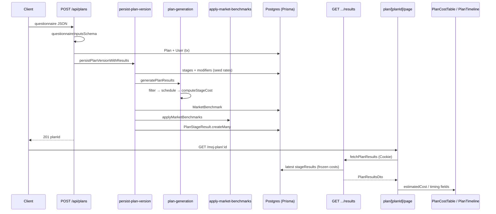

# Research: Przepływ danych kalibracji kosztów

**Date**: 2026-06-12  
**Researcher**: Cursor Agent (Auto)  
**Git Commit**: `feec9185d8af94b9bb468c600a73059ee6248a19`  
**Branch**: `master`  
**Repository**: home-build-planner

## Research Question

Przeanalizuj przepływ danych w obszarze **kalibracji kosztów i wyników planu**, z uwzględnieniem powiązań z `context/map/repo-map.md`: write path (POST plans → silnik → DB), read path (GET results → DTO → UI), źródło stawek (`prisma/seed.ts`), blast radius i luki testów.

**Wybrany przepływ (zgodnie z repo-map):** *Generuj plan* + *Pokaż wynik* — od walidacji ankiety przez `persist-plan-version` i `plan-generation` do zamrożonych `PlanStageResult`, potem odczyt bez przeliczania kosztów.

---

## Summary

- **Write:** JSON ankiety → `questionnaireInputsSchema` → `persistPlanVersionWithResults` ładuje stawki z DB (seed) → pure `generatePlanResults` (filter → schedule → compute) → opcjonalnie `applyMarketBenchmarks` → zapis `PlanStageResult`.
- **Read:** GET results składa `PlanResultsDto` ze **zapisanych** kosztów (brak ponownego wywołania silnika); UI kosztorysu i timeline czyta ten sam DTO.
- **Kontrakty repo-map potwierdzone:** `validations/questionnaire.ts` (12← prod direct, 19← transitive) i `plan-results.ts` (13← prod direct, 18← transitive) to najszersze szwy; `persist-plan-version` ma tylko 2 importerów prod.
- **Testy:** silnik kosztów i golden oracle dobrze pokryte; **luki:** `scheduleTimeline`, integracja benchmarków w persist, GET pusty plan, `fetchPlanResults`.
- **Blast radius:** zmiana stawek = seed + fixtures + testy oracle; zmiana logiki = `compute-costs` + oracle; zmiana kształtu wyniku = schema + DTO + route + UI.

---

## 1. Feature overview

### 1.1 Cel produktowy (FR-006, FR-008)

**EVIDENCE:** PRD wymaga orientacyjnego kosztorysu etapów + harmonogramu po ankiecie; system analizuje odpowiedzi i generuje wstępną wycenę (`context/foundation/prd.md` FR-006, FR-008).

**INFERENCE:** „Kalibracja kosztów” w runtime = stawki w `ConstructionStage` / `StageCostModifier` (seed) + formuły w `plan-generation/` + opcjonalne mnożniki `MarketBenchmark` — nie przeliczanie przy odczycie.

### 1.2 Write path — sekwencja (skrót)

| # | Krok | Plik:linia |
|---:|---|---|
| 1 | Auth Supabase | `src/app/api/plans/route.ts:12-19` |
| 2 | Walidacja `questionnaireInputsSchema` | `route.ts:22-28`, `validations/questionnaire.ts:143-163` |
| 3 | Tx: User upsert, Plan create | `route.ts:32-49` |
| 4 | Orkiestracja zapisu | `route.ts:51-55` → `persist-plan-version.ts:10-66` |
| 5 | Load stages + modifiers (stawki z DB) | `persist-plan-version.ts:33-36` |
| 6 | Mapowanie odpowiedzi | `responses-map.ts:6-11` |
| 7 | `generatePlanResults` | `generate-plan-results.ts:10-29` |
| 7a | `filterStages` | `stage-filter.ts:16-68` |
| 7b | `scheduleTimeline` | `schedule-timeline.ts:37-80` |
| 7c | `computeStageCost` | `compute-costs.ts:73-97` |
| 8 | `applyMarketBenchmarks` | `apply-market-benchmarks.ts:27-88` |
| 9 | Zapis `PlanStageResult` | `persist-plan-version.ts:55-64` |
| 10 | 201 `{ planId }` | `route.ts:67` |

**EVIDENCE:** Przeliczenie używa tego samego orkiestratora: `recalculate/route.ts:73-77` (+ rate limit).

**EVIDENCE (E2E):** Golden path omija UI ankiety — bezpośredni POST z payloadem: `e2e/risk-04-generate-golden-path.spec.ts:21-23`, `e2e/fixtures/golden-questionnaire-payload.ts:5-23`.

**EVIDENCE (UI):** Pełna ankieta → POST: `questionnaire-form.tsx:131-161`.

### 1.3 Read path — sekwencja (skrót)

| # | Krok | Plik:linia |
|---:|---|---|
| 1 | RSC plan page lub dashboard, auth | `plan/[planId]/page.tsx:57-64`, `dashboard/page.tsx:45` |
| 2 | `fetchPlanResults` (loopback + cookies) | `fetch-plan-results.ts:12-24` — **2 call-site'y prod** |
| 3 | GET results, ownership | `results/route.ts:18-44` |
| 4 | Load latest version + `stageResults` | `results/route.ts:28-40` |
| 5 | Join nazw/kategorii etapów | `results/route.ts:54-74` |
| 6 | `totalCost = sum(estimatedCost)` | `results/route.ts:76` |
| 7 | `PlanResultsDto` | `results/route.ts:79-88`, `plan-results.ts:16-25` |
| 8 | UI: `PlanCostTable`, `PlanTimeline` | `plan-cost-table.tsx:22-78`, `plan-timeline.tsx` (timing z DTO) |

**EVIDENCE:** GET **nie** woła `plan-generation` — koszty są zamrożone w DB.

### 1.4 Źródło stawek (kalibracja danych)

| Warstwa | Plik | Rola |
|---|---|---|
| Seed etapów | `prisma/seed.ts` (`seedStages`, ~L238+) | `costPerM2Economy/Standard/Premium`, duration, predecessors |
| Seed modyfikatorów | `prisma/seed.ts` (`seedModifiers`, ~L1088+) | Triggery pytań → dopłaty |
| Benchmarki | `seedMarketBenchmarks` + `prisma/data/market-benchmarks.json` | Mnożniki per `stageCategory` |
| Runtime load | `persist-plan-version.ts:33-36`, `:41` | `findMany` stages/modifiers/benchmarks |

**EVIDENCE:** Parity seed ↔ fixtures: `calibration-seed-parity.test.ts` (czyta seed przez `readFileSync`, poza grafem importów depcruise).

**UNKNOWN:** Czy w danym środowisku `MarketBenchmark` ma wiersze — pusty zestaw = refinement no-op (`apply-market-benchmarks.ts:32-38`).

### 1.5 Diagram przepływu (Mermaid)

### 1.6 Powiązania z repo-map.md

| Decyzja mapy | Potwierdzenie w tym przepływie |
|---|---|
| #1 Dwa API wewnętrzne | Zod ankiety na wejściu; DTO na wyjściu |
| #3 Write path wąski | Tylko POST plans + recalculate → persist |
| #4 Read path szeroki | DTO → cost table, timeline, dashboard, kalendarz |
| #5 Silnik pure | Brak prisma w `plan-generation/` (depcruise) |
| Indeks „Koszt / harmonogram” | `plan-generation/`, `persist-plan-version.ts` |
| Indeks „Widok wyniku” | `plan-results.ts`, `results/route.ts`, `plan-cost-table.tsx` |

---

## 2. Technical debt

### 2.1 Luki testów (priorytet)

| Obszar | Gap | Etykieta |
|---|---|---|
| `scheduleTimeline` | Brak pliku testowego; brak asercji `startDay`/`durationDays` w całym łańcuchu generacji | **EVIDENCE** (brak `schedule-timeline.test.ts`) |
| `fetchPlanResults` | Brak unit testów (401/404/error/ok, cookies) | **EVIDENCE** |
| GET results | Branch `"Brak wyników dla tego planu"` (puste `stageResults`) nieassertowany | **EVIDENCE** (`results/route.ts:47-51` vs brak testu GET) |
| Benchmark + persist | `applyMarketBenchmarks` unit OK; persist zawsze mockuje `benchmarks: []` | **EVIDENCE** (`persist-plan-version.test.ts`, handler mocks) |
| `computeStageCost` guards | Brak testów: area≤0, brak `build_standard`, water distance `isModifierActive` | **EVIDENCE** |
| `filterStages` | Brak testów: target ≠ DEVELOPER, brak odpowiedzi, etap poza targetem | **EVIDENCE** |
| GET DTO fields | `totalCost`, `refinementApplied`, `benchmarkAsOf` w mocku, bez asercji | **EVIDENCE** |
| POST 409 duplicate plan | Brak unit testu; E2E akceptuje 409 | **EVIDENCE** |

**INFERENCE:** Regresja sortowania timeline vs tabela (naprawiona S-11) mogłaby wrócić bez testu na spójność `startDay` między widgetami.

**UNKNOWN:** Pokrycie linii (vitest `--coverage`) — nie uruchomiono.

### 2.2 Coupling / architektura

| Problem | Opis | Etykieta |
|---|---|---|
| DTO drift | Zmiany kształtu częściej w `results/route.ts` niż w `plan-results.ts` | **INFERENCE** (artifact-2, artifact-3) |
| Brak walidacji DTO na read | `fetch-plan-results.ts:38` — cast JSON bez Zod | **EVIDENCE** |
| `investment-state` → `@prisma/client` | Kontrakt domenowy sprzężony z ORM | **EVIDENCE** (`investment-state.ts:1`) |
| Seed poza grafem depcruise | Coupling tylko przez test parity + runtime Prisma | **EVIDENCE** |
| Read: dwa wzorce | Plan page → API fetch; dashboard/ankieta → prisma bezpośrednio | **EVIDENCE** (repo-map #108) |
| Koszty nie przeliczane na read | Zamierzone; zmiana stawek w seed nie aktualizuje starych planów bez recalculate | **EVIDENCE** + **INFERENCE** |

### 2.3 Blast radius — co musi iść razem

**EVIDENCE (git co-change, 30 commitów na ścieżce kosztów):**

| Zmiana | Współzmiany (commits) | Pliki / pakiety |
|---|---|---|
| Stawki PLN/m² | plan-gen + seed **4×** | `prisma/seed.ts`, `test-fixtures/*`, golden tests |
| Nowe pytanie / trigger | questionnaire + seed **5×**, prisma + validations **6×** | seed, `validations/questionnaire.ts`, UI ankiety, `stage-filter` |
| Logika kosztu | — (persist rzadko w tym samym commicie co seed) | `compute-costs.ts`, `parse-modifier.ts`, oracle |
| Kształt wyniku | plan-results + results-route **3×** | schema + migracja, `plan-results.ts`, `results/route.ts`, `components/plan/*` |

**EVIDENCE (depcruise):**

| Moduł | Direct ← prod | Transitive ← prod |
|---|---:|---|
| `persist-plan-version.ts` | 2 route handlery | 2 |
| `plan-generation/index.ts` | persist + refinement (2) | 4 (→ 2 route handlery) |
| `validations/questionnaire.ts` | 12 | 19 |
| `plan-results.ts` | 13 | 18 |

**Uwaga:** wcześniejsze liczby 18 / 14 dotyczyły **wszystkich plików z importem** (w tym testy i fixtures), nie fan-in prod z depcruise — patrz §3.

**INFERENCE:** Edycja samego `plan-results.ts` (3 commity historycznie) vs UI/route (częściej) — typ „stabilny kontrakt, zmienny assembler”.

### 2.4 Dług procesowy (solo + archiwum)

| Temat | Opis | Etykieta |
|---|---|---|
| Bus factor 1 | Wiedza o semantyce DTO/notatek u ownera | **EVIDENCE** (artifact-3) |
| Zarchiwizowany S-01 | `context/archive/2026-06-09-cost-calibration/` — inny change niż ten folder; unikać pomyłki slugów | **EVIDENCE** |
| Owner-only migrate/seed | Nowe pola w `PlanStageResult` wymagają owner `pnpm db:migrate` | **EVIDENCE** (`lessons.md`) |
| Decyzje odrzucone | Merged cost+timeline, wykresy — w frame S-11, nie w kodzie | **EVIDENCE** (`plan-results-polish-details/frame.md`) |

---

## 3. Structural claims verification (ast-grep + depcruise)

Weryfikacja na commicie `feec9185` (`ast-grep` 0.43.0, `pnpm exec depcruise src`). Dla wyników **0** — potwierdzenie klasycznym `rg`.

| # | Twierdzenie strukturalne | Wzorzec ast-grep | Werdykt | Dowód (plik:linia) |
|---:|---|---|---|---|
| 1 | `persist-plan-version` — tylko **2 importerów prod** | `persistPlanVersionWithResults($$$)` | **potwierdzone** | prod: `src/app/api/plans/route.ts:50`, `src/app/api/plans/[planId]/recalculate/route.ts:72`; test: `persist-plan-version.test.ts:59,79,100` (5 wywołań łącznie). Import prod: `rg 'from "@/lib/plan/persist-plan-version"'` → 2 pliki. depcruise direct=2. |
| 2 | `generatePlanResults` — **1 call-site prod** (tylko persist) | `generatePlanResults($$$)` | **potwierdzone** | prod: `src/lib/plan/persist-plan-version.ts:38`; testy: `generate-plan-results.test.ts` (8×), `questionnaire-pipeline.test.ts` (3×) — 12 łącznie. |
| 3 | `applyMarketBenchmarks` — **1 call-site prod** (tylko persist) | `applyMarketBenchmarks($$$)` | **potwierdzone** | prod: `src/lib/plan/persist-plan-version.ts:41`; test: `apply-market-benchmarks.test.ts:34,45,63,73,87,97` — 7 łącznie. |
| 4 | Pipeline silnika: **filter → schedule → compute** w jednym miejscu | `filterStages($$$)`, `scheduleTimeline($$$)`, `computeStageCost($$$)` | **potwierdzone** | Jedyny łańcuch prod w `generate-plan-results.ts:14,15,24`. Call-site'y prod: filter=1, schedule=1, compute=1 (reszta w testach). |
| 5 | GET results **nie woła** `plan-generation` | `rg 'plan-generation' src/app/api/plans/[planId]/results/` | **potwierdzone** | 0 dopasowań (`rg` exit 1). |
| 6 | **Brak Prisma** w kodzie prod `plan-generation/` | `import { $$$ } from "@prisma/client"` w `src/lib/plan-generation` | **doprecyzowane** | ast-grep: 2 pliki — wyłącznie `test-fixtures/minimal-stages.ts`, `test-fixtures/full-stages-calibration.ts`. `rg '@prisma/client' … --glob '!*.test.ts' \| rg -v test-fixtures` → 0. Kod prod silnika jest pure. |
| 7 | `fetchPlanResults` — call-site'y prod | `fetchPlanResults($$$)` | **doprecyzowane** | 2 prod: `src/app/(app)/plan/[planId]/page.tsx:65`, `src/app/(app)/dashboard/page.tsx:45` (raport wcześniej podkreślał tylko plan page). |
| 8 | `validations/questionnaire.ts` — **18←** (najszerszy szew) | `import … from "@/lib/validations/questionnaire"` | **doprecyzowane** | ast-grep: 8 named + 10 type = **18 plików z importem** (w tym testy/fixtures). depcruise **prod direct=12**, transitive=19. Poprzednia liczba 18 = pliki importujące, nie fan-in prod. |
| 9 | `plan-results.ts` — **14← direct** | `import type { $$$ } from "@/lib/plan-results"` | **doprecyzowane** | ast-grep type imports: **14 plików** (13 prod + `sort-plan-stages-chronologically.test.ts:4`). depcruise **prod direct=13**, transitive=18. |
| 10 | `plan-generation/index.ts` — direct **persist + refinement** | depcruise `--output-type json` | **potwierdzone** | direct=2: `persist-plan-version.ts`, `apply-market-benchmarks.ts`; transitive=4 (→ `route.ts`, `recalculate/route.ts`). |
| 11 | Brak `schedule-timeline.test.ts` | `test -f …` + `rg 'schedule-timeline\.test'` | **potwierdzone** | plik nie istnieje; 0 dopasowań `rg`. |
| 12 | Brak `fetch-plan-results.test.ts` | `test -f …` + `rg 'fetch-plan-results\.test'` | **potwierdzone** | plik nie istnieje; 0 dopasowań `rg`. |
| 13 | `questionnaireInputsSchema.*parse` — wejście write | `questionnaireInputsSchema.$METHOD($$$)` | **doprecyzowane** | ast-grep: 19 wywołań. Prod `safeParse`: `route.ts:22`, `recalculate/route.ts:29`, `questionnaire-form.tsx:134`, `responses-to-inputs.ts:39`; reszta w testach. |

**depcruise prod direct — pełna lista importerów `plan-results.ts` (13):**  
`results/route.ts`, `fetch-plan-results.ts`, `plan-snapshot-card.tsx`, `plan-summary-strip.tsx`, `plan-cost-table.tsx`, `plan-timeline.tsx`, `calendar-export-controls.tsx`, `stage-note-controls.tsx`, `layout-timeline-stages.ts`, `load-plan-stage-notes.ts`, `sort-plan-stages-chronologically.ts`, `upsert-plan-stage-note.ts`, `build-stage-events.ts`.

**depcruise prod direct — importerzy `questionnaire.ts` (12):**  
`route.ts`, `recalculate/route.ts`, `questionnaire-form.tsx`, `questionnaire-summary.tsx`, `step-content.tsx`, `question-renderers.tsx`, `responses-to-inputs.ts`, `persist-plan-version.ts`, `compute-costs.ts`, `responses-map.ts`, `stage-filter.ts`, `hints/types.ts`.

---

## Detailed Findings (sub-agents)

### Trace E2E (Agent 1)

Pełna sekwencja 37 kroków write + read, diagram sequenceDiagram, lista UNKNOWN (middleware, loopback origin, 409 retry, coaching orthogonal) — zsyntetyzowane w sekcjach 1.2–1.5 powyżej.

### Test gaps (Agent 2)

Mapa modułów: questionnaire schema (dobra), engine oracle (dobra), `scheduleTimeline` / `fetchPlanResults` (brak), integracja benchmarków (luka), GET branches (częściowa) — tabela w §2.1.

### Blast radius (Agent 3)

Checklist „You change… → Must change together”; depcruise `--reaches`; git co-change — tabela w §2.3.

---

## Code References

- `src/app/api/plans/route.ts:51-55` — entry write path
- `src/lib/plan/persist-plan-version.ts:33-64` — load rates, generate, refine, persist
- `src/lib/plan-generation/compute-costs.ts:73-97` — koszt etapu
- `src/lib/plan-refinement/apply-market-benchmarks.ts:27-88` — mnożniki rynkowe
- `src/app/api/plans/[planId]/results/route.ts:64-88` — assembler DTO (read)
- `src/lib/plan-results.ts:16-25` — kontrakt wyniku
- `prisma/seed.ts` — źródło stawek kalibracji
- `src/lib/plan-generation/calibration-seed-parity.test.ts` — guard drift seed ↔ fixtures
- `e2e/risk-04-generate-golden-path.spec.ts` — E2E write+read UI

---

## Architecture Insights

1. **Freeze-on-write:** koszty są obliczane raz przy wersji planu; read path jest cienki i szybki, ale **stare plany nie odzwierciedlają nowego seeda** bez recalculate.
2. **Trzy warstwy kalibracji:** (a) seed rates, (b) engine formulas/modifiers, (c) benchmark multipliers — każda ma inny blast radius testów.
3. **Repo-map granice zmiany działają:** git co-change potwierdza pary questionnaire↔seed i plan-gen↔seed.
4. **Lessons.md:** domain data przez API + Prisma; questionnaire cross-field rules split form vs API schema — dotyczy wejścia write path.

---

## Historical Context

- `context/archive/2026-06-09-cost-calibration/` — slice S-01: kalibracja stawek seed, golden oracle, E2E verify (**zamknięty**).
- `context/archive/2026-05-27-plan-generation/` — geneza GET results + pierwszy UI wyników.
- `context/archive/2026-05-27-internet-refinement/reviews/impl-review.md` — refinement metadata w DTO; NaN guard przy imporcie benchmarków.
- `context/archive/2026-06-02-plan-results-polish-details/frame.md` — mobile timeline; **nie** merge widoków.
- `context/map/repo-map.md` — synteza terytorium/struktury/wiedzy dla tego researchu.

---

## Open Questions

1. **UNKNOWN:** Procedura odświeżenia stawek na produkcji po zmianie seed (re-seed vs migrate vs tylko nowe plany).
2. **UNKNOWN:** Zachowanie gdy `MarketBenchmark` puste vs multipliers ≠ 1.0 w prod.
3. **UNKNOWN:** Czy planowany read service layer (RSC prisma vs fetch) będzie ujednolicony.
4. **INFERENCE:** Czy ten change (`cost-calibration` w `context/changes/`) ma prowadzić do nowej kalibracji stawek, czy tylko dokumentacji przepływu — `change.md` Notes są ogólne.

---

## Related Research

- `context/map/artifact-1-territory.md` — co-change git, stale terytoria
- `context/map/artifact-2-structure.md` — fan-in, blast radius depcruise
- `context/map/artifact-3-contributors.md` — wiedza o `plan-results`, must-read archiwum
- `context/archive/2026-06-09-cost-calibration/research.md` — poprzedni research S-01 (archiwum)
